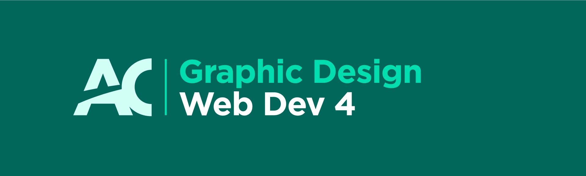

# 

#### This 15 week course is focused on creating a personal website covering supplemental topics like domains, writing for the web, Jekyll, video, SEO, 404 pages, progressive enhancement & analytics.

---

[**Thomas J Bradley**](http://thomasjbradley.ca) — office: **J104** — [bradlet@algonquincollege.com](mailto:bradlet@algonquincollege.com)

---
---

## Week-by-week

Below is the complete breakdown of everything that will be covered over the next fifteen weeks.

---

### **1. Intro & review**

**Review topics**

- [Everything from **Set up**](http://learn-the-web.algonquindesign.ca/topics/#set-up)
- [Everything from **Web Dev 1**](http://learn-the-web.algonquindesign.ca/topics/#web-dev-1)
- [Everything from **Web Dev 2**](http://learn-the-web.algonquindesign.ca/topics/#web-dev-2)
- [Everything from **Web Dev 3**](http://learn-the-web.algonquindesign.ca/topics/#web-dev-3)

**In class**

- Course introduction, Q&A, system of the term
- Lecture:
  - Our goals this term
  - Overview of your portfolio
  - [Naming conventions](http://learn-the-web.algonquindesign.ca/topics/naming-paths-cheat-sheet/)
  - Intro to domains:
    Domain — $15/y, .ca
    Email — $40/y (30 days free) or Forwarder — $5/y

**Homework**

- [**Assignment 1: Business card site—3 hours**]()
- *Figure out what domain you want for next week.*
- *Look for inspiration & portfolio layout ideas.*
- **Bring a credit card!**

---

### **2. Domains, e-mails, hosting**

**Topics**

- [Domains & DNS](http://learn-the-web.algonquindesign.ca/topics/domains/)

**In class**

- Lecture:
  - How the web & DNS works
- Demos:
  - Purchasing a domain at [Hover](https://www.hover.com/)
  - Setting up [CloudFlare](https://www.cloudflare.com/)
  - Setting up a custom domain on GitHub
  - Setting up email at [FastMail](https://www.fastmail.com/)

**Homework**

- **Assignment 2: Domain setup—completed in class**
- *Start thinking about wireframes & content*

---

### **3. Writing for the web**

**Topics**

- [Writing for the web](http://learn-the-web.algonquindesign.ca/topics/writing-for-the-web/)
- [Writing checklist](http://learn-the-web.algonquindesign.ca/topics/writing-checklist/)
- [Markdown](http://learn-the-web.algonquindesign.ca/topics/markdown/)
- [YAML](http://learn-the-web.algonquindesign.ca/topics/yaml/)
- [Markdown & YAML cheat sheet](http://learn-the-web.algonquindesign.ca/topics/markdown-yaml-cheat-sheet/)
- [Writing a readme](http://learn-the-web.algonquindesign.ca/topics/writing-a-readme/)

**In class**

- [*Exercise: writing for the web*](https://github.com/acgd-webdev-4/exercise-writing-for-the-web)
- Video: [Start with why](http://www.ted.com/talks/simon_sinek_how_great_leaders_inspire_action)
- [*Exercise: writing with personality*](https://github.com/acgd-webdev-4/exercise-writing-with-personality)
- Demo: Markdown syntax basics
- [*Exercise: writing in Markdown*](https://github.com/acgd-webdev-4/exercise-writing-in-markdown)
- Demo: YAML syntax basics
- [*Exercise: systemizing content in YAML*](https://github.com/acgd-webdev-4/exercise-systemizing-content-in-yaml)

**Homework**

- [**Assignment 3: Readme, why & system—completed in class**](https://github.com/acgd-webdev-4/assignment-3)
- [**Portfolio website, part 1: Interactive wireframes—8 hours**](https://github.com/acgd-webdev-4/portfolio-wireframes)

---

### **4. Portfolio, part 1 work period**

**In class**

- *Activity*
- Work time, Q&A time, one-on-one feedback

**Homework**

- Continue working on Portfolio, part 1

---

### **5. Portfolio, part 1 due**

**Topics**

- [Browser testing checklist](http://learn-the-web.algonquindesign.ca/topics/browser-testing-checklist/)
- [Accessibility checklist](http://learn-the-web.algonquindesign.ca/topics/accessibility-checklist/)

**In class**

- Browser testing, peer testing, accessibility testing

---

### **6. Video**

**Topics**

- [Video & audio](http://learn-the-web.algonquindesign.ca/topics/video/)

**In class**

- Understanding video on the web
- Demos:
  - Compressing videos with Adobe Media Encoder
  - Large video billboards
  - Controlling videos with Javascript

**Homework**

- **Assignment 4: Accessibility—3 hours**

---

### **7. Layouts & Jekyll**

**Topics**

- [Jekyll](http://learn-the-web.algonquindesign.ca/topics/jekyll/)
- [Jekyll installation](http://learn-the-web.algonquindesign.ca/topics/jekyll-installation/)
- [Jekyll terminal guide](http://learn-the-web.algonquindesign.ca/topics/jekyll-terminal-guide/)
- [Jekyll cheat sheet](http://learn-the-web.algonquindesign.ca/topics/jekyll-cheat-sheet/)

**In class**

- Why Jekyll
- Installing Jekyll on your computer
- Demos:
  - Setting up a basic website
  - Creating layouts
  - Jekyll & SEO

**Homework**

- **Assignment 5: Layouts—3 hours**

---

### **8. SEO, enhanced metadata & analytics**

**Topics**

- [Search engine optimization](http://learn-the-web.algonquindesign.ca/topics/search-engine-optimization/)
- [Metadata & enhanced semantics](http://learn-the-web.algonquindesign.ca/topics/metadata-enhanced-semantics/)
- [Analytics & monitoring](http://learn-the-web.algonquindesign.ca/topics/analytics-monitoring/)
- [SEO checklist](http://learn-the-web.algonquindesign.ca/topics/seo-checklist/)

**In class**

- Understanding SEO
- Demos:
  - Important content
  - Title tag system
  - Meta description
  - Sitemaps
  - Robots & humans
  - Microdata contact
  - Analytics packages

**Homework**

- **Assignment 6: SEO & metadata—3 hours**
- **Portfolio website, part 2: Javascript-less version—8 hours**

---

### **9. Portfolio, part 2 work period**

**In class**

- *Activity*
- Work time, Q&A time, one-on-one feedback

**Homework**

- Continue working on Portfolio, part 2

---

### **10. Portfolio, part 2 due**

**Topics**

- [Browser testing checklist](http://learn-the-web.algonquindesign.ca/topics/browser-testing-checklist/)
- [Performance checklist](http://learn-the-web.algonquindesign.ca/topics/performance-checklist/)
- [Accessibility checklist](http://learn-the-web.algonquindesign.ca/topics/accessibility-checklist/)

**In class**

- Browser testing, performance testing, peer testing, accessibility testing

---

### **11. Progressive enhancement & accessibility**

**Topics**

- [Accessibility](http://learn-the-web.algonquindesign.ca/topics/accessibility/)
- [Progressive enhancement](http://learn-the-web.algonquindesign.ca/topics/progressive-enhancement/)

**In class**

- Why progressive enhancement and accessibility
- Demos:
  - Making something with & without Javascript

**Homework**

- **Assignment 7: Progressive enhancement—3 hours**

---

### **12. Performance**

**Topics**

- [Performance](http://learn-the-web.algonquindesign.ca/topics/performance/)
- [Advanced performance](http://learn-the-web.algonquindesign.ca/topics/advanced-performance/)
- [Advanced performance checklist](http://learn-the-web.algonquindesign.ca/topics/advanced-performance-checklist/)

**In class**

- Performance and the web
- Demos:
  - Image Alpha + PNG-8s
  - Blurring JPGs
  - Optimizing favicons
  - CloudFlare performance settings

**Homework**

- **Assignment 8: Performance—3 hours**

---

### **13. 404 pages**

**Topics**

- [404 pages](http://learn-the-web.algonquindesign.ca/topics/404-pages/)

**In class**

- Looking at what makes 404 pages useful
- Demo:
  - Setting up a 404 page on GitHub

**Homework**

- **Assignment 9: 404 page—3 hours**
- **Portfolio website, part 3: Details—8 hours**

---

### **14. Portfolio, part 3 work period**

**In class**

- *Activity*
- Work time, Q&A time, one-on-one feedback

**Homework**

- Continue working on Portfolio, part 3

---

### **15. Portfolio, part 3 due**

**Topics**

- [Browser testing checklist](http://learn-the-web.algonquindesign.ca/topics/browser-testing-checklist/)
- [Advanced performance checklist](http://learn-the-web.algonquindesign.ca/topics/advanced-performance-checklist/)
- [Accessibility checklist](http://learn-the-web.algonquindesign.ca/topics/accessibility-checklist/)
- **[Launch checklist, Web Dev 4](http://learn-the-web.algonquindesign.ca/topics/launch-checklist-web-dev-4/)**

**In class**

- Browser testing, performance testing, peer testing, accessibility testing

---
---

## Marking scheme

- **Assignments** — 55% (9 × ~6%)
- **Projects** — 45% (3 × 15%)

---
---

## License & Copyright

[**☛ Refer the the license & copyright statement.**](https://github.com/acgd-webdev-4/meta)
